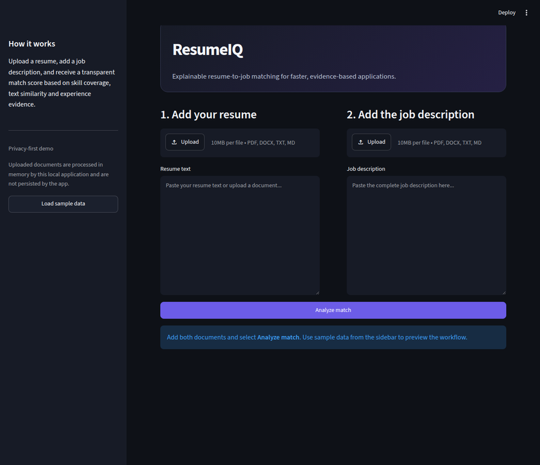
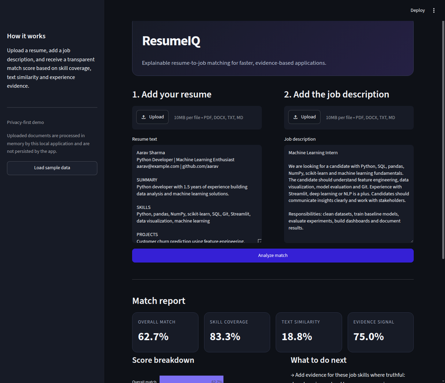
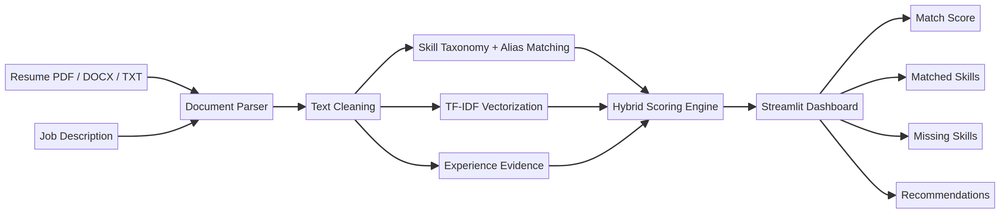

# ResumeIQ — Explainable Resume–Job Matcher

ResumeIQ is an interactive Streamlit application that compares a candidate resume with a job description and produces an explainable alignment report. It combines canonical skill extraction, TF-IDF text similarity and experience evidence into a transparent score. The goal is to help candidates tailor applications while keeping the result interpretable rather than presenting an opaque prediction.

> **Live demo:** deploy this repository on Streamlit Community Cloud and add the generated app URL here.

## Screenshots

### Input workspace



### Explainable match report



## Why this project matters

Candidates often use the same resume for different jobs even though every role prioritises different skills and terminology. ResumeIQ automates the first comparison and shows where the resume aligns, where evidence is missing and how the candidate can improve it. The application is designed as an assistive tool; it does not make hiring decisions and should not be used as an automated screening system.

## Features

| Capability | Description |
|---|---|
| Multi-format ingestion | Reads PDF, DOCX, TXT and Markdown files. |
| Hybrid matching | Combines skill coverage, TF-IDF similarity and experience signals. |
| Explainability | Shows matched skills, missing skills, score components and recommendations. |
| Resume quality signals | Detects the presence of email, phone, LinkedIn and GitHub fields without persisting their values. |
| Interactive dashboard | Streamlit interface with score cards, charts and expandable methodology. |
| Testing | Pytest coverage for aliases, scoring, missing skills and section parsing. |

## Architecture



The application follows a simple pipeline:

```text
Resume + Job Description
          ↓
PDF/DOCX/TXT parser
          ↓
Text cleaning and normalisation
          ↓
Skill taxonomy and alias matching
          ↓
Skill coverage + TF-IDF similarity + experience evidence
          ↓
Hybrid scoring engine
          ↓
Streamlit dashboard with recommendations
```

The editable Mermaid source for the architecture is available at [`docs/architecture.mmd`](docs/architecture.mmd).

## Scoring methodology

The overall score is an assistive signal calculated as follows:

```text
Overall score = 0.55 × skill coverage
              + 0.30 × TF-IDF text similarity
              + 0.15 × experience evidence
```

Skill coverage is the proportion of job-description skills detected in the resume. Text similarity uses a TF-IDF vectorizer with unigram and bigram features. Experience evidence compares explicit year-of-experience signals where available. The application exposes each component so that a user can understand why the score changes.

| Component | Weight | Interpretation |
|---|---:|---|
| Skill coverage | 55% | Percentage of detected job skills also found in the resume. |
| TF-IDF similarity | 30% | Similarity between important resume and job-description terms. |
| Experience evidence | 15% | Alignment between explicit experience-year signals. |

## Project structure

```text
resume_job_matcher/
├── app/
│   └── main.py                 # Streamlit entry point
├── src/
│   ├── matcher.py              # Skill taxonomy and scoring engine
│   ├── parser.py               # PDF, DOCX and text parsing utilities
│   └── __init__.py
├── tests/
│   └── test_matcher.py         # Automated tests
├── docs/
│   ├── PROJECT_REPORT.md       # Technical project report
│   ├── PROJECT_EXPLANATION.md  # Presentation and viva guide
│   └── architecture.mmd       # Editable architecture diagram
├── assets/
│   ├── architecture.png
│   ├── resumeiq-home.webp
│   └── resumeiq-result.webp
├── .streamlit/config.toml
├── requirements.txt
└── README.md
```

## Local setup

Use Python 3.10 or newer. From the project directory, create and activate a virtual environment, then install the dependencies:

```bash
python -m venv .venv
# Windows PowerShell
.venv\Scripts\Activate.ps1
# Windows Command Prompt
.venv\Scripts\activate.bat
pip install -r requirements.txt
```

Run the application:

```bash
streamlit run app/main.py
```

The browser will open the interface. If it does not open automatically, visit the URL printed in the terminal, normally `http://localhost:8501`. On Windows, the included `run_app.bat` file can also be double-clicked.

The baseline does not require a downloaded transformer model; it uses deterministic TF-IDF similarity so that the application remains fast and reproducible. A semantic embedding layer can be added later as a separately evaluated upgrade.

## Usage

Upload a resume in PDF, DOCX, TXT or MD format, paste the complete job description, and select **Analyze match**. The report includes an overall match percentage, component scores, matched skills, skills to strengthen, resume completeness signals and tailored recommendations. Use the sidebar sample data to preview the workflow.

## Tests

Run the automated tests from the repository root:

```bash
pytest -q
```

The test suite covers skill aliases, high-alignment matching, missing-skill detection, text cleaning and section parsing.

## Streamlit Community Cloud deployment

1. Open [share.streamlit.io](https://share.streamlit.io/) and sign in with the GitHub account that owns this repository.
2. Select **Create app** or **Deploy an app**.
3. Choose repository `jaisingmeet/Resume-job-matcher`.
4. Select branch `main`.
5. Enter `app/main.py` as the main file path.
6. Select the Python version if Streamlit asks; Python 3.10 or newer is suitable.
7. Select **Deploy** and wait for dependency installation from `requirements.txt`.
8. Open the generated app URL, click **Load sample data**, and select **Analyze match** to verify the complete workflow.
9. Copy the generated public URL into the **Live demo** line near the top of this README.

ResumeIQ does not require secrets or an API key. If you later add an external LLM, store its key in Streamlit Cloud Secrets and never commit it to GitHub.

## Responsible-use note

Resume data may contain sensitive personal information. In this demo, documents are read in memory and are not saved by the application. Do not upload private documents to an untrusted deployment. The score is not a measure of a person's ability, and it should never be used as the sole basis for employment decisions.

## Future improvements

The next portfolio iteration can add sentence-transformer embeddings, a configurable skill taxonomy, a labelled evaluation dataset, recruiter-facing batch analysis, a RAG assistant for resume improvement and an agentic workflow that converts missing skills into a personalised learning plan. Those additions should be evaluated separately from the baseline so that improvements remain measurable.

## Documentation

Read the [technical project report](docs/PROJECT_REPORT.md) for the problem statement, architecture, methodology, evaluation plan and limitations. Read the [presentation and viva guide](docs/PROJECT_EXPLANATION.md) for the complete workflow, tool explanations, applications and likely questions.

## Portfolio bullet

> Built ResumeIQ, an explainable Streamlit resume–job matching application that parses PDF/DOCX/TXT files and combines skill coverage, TF-IDF similarity and experience evidence to generate actionable tailoring recommendations.
